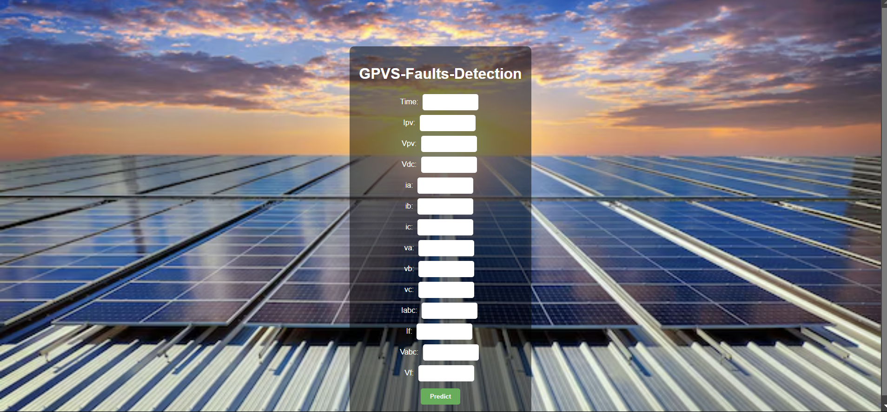

# Solar GPVS Fault Detection

This Project focuses on detecting faults in solar generation plants using advanced data analysis and machine learning techniques. The primary objective is to identify and classify faults to enhance the efficiency and reliability of solar power generation systems. Manual inspection of solar GPVS systems often fails to detect certain defects, leading to decreased energy production and system inefficiencies. The project aims to automate fault detection in these systems.

## Project Architecture

The project architecture follows a structured approach to handle data, preprocess it, train models, and evaluate the results for fault detection in Solar GPVS.

## Data Dictionary

* **Features:** The dataset includes 11 feature columns.
* **Description:**
  * **Time** : Timestamp for recording measurements.
  * **Ipv, Vpv, Vdc, ia, ib, ic, va, vb, vc, Iabc, Ifr, Vabc, Vf** : Various parameters related to current, voltage, and other electrical properties of the GPVS system.
  * **Defective_NonDefective:** Label indicating the fault status (Defective or Non-Defective).
* **Size:** 30,000 records.

## Exploratory Data Analysis (EDA)

Key steps performed during EDA include:

1. Checking for null values in the dataset.
2. Identifying duplicate values.
3. Verifying the data types of columns.
4. Assessing kurtosis and skewness.
5. Replacing outliers using Winsorization.

## Data Visualization

* **Boxplot Analysis:** Used to identify and visualize outliers in the dataset.

## Data Preprocessing

* **First Moment of Business Decision:** Mean, Median, Mode calculations.
* **Second Moment of Business Decision:** Range, Standard Deviation, Variance.
* **Third Moment of Business Decision:** Skewness analysis.
* **Fourth Moment of Business Decision:** Kurtosis analysis.
* **Outlier Treatment:** Implemented Winsorization method.
* **Automated EDA Tools:** Used Sweetviz and Dtale for auto EDA.
* **Data Transformation:** Standardization using `StandardScaler`.

## Model Strategy

Several classification algorithms were implemented to build the fault classification model:

1. Logistic Regression
2. K-Nearest Neighbors (KNN)
3. Naive Bayes
4. Decision Trees
5. Random Forests
6. XGBoost
7. Support Vector Machines (SVM)

### Result

